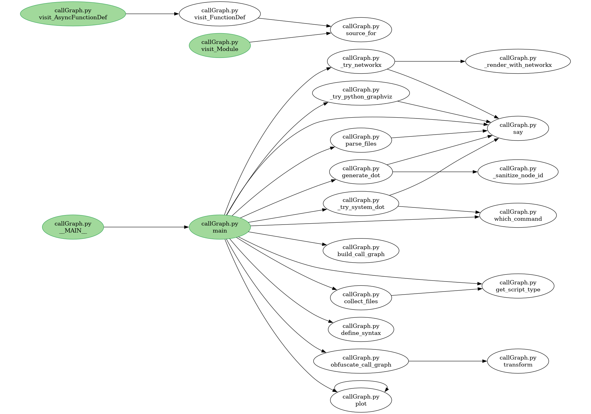

# callGraph.py — Static call-graph generator (Python rewrite of [callGraph](https://github.com/koknat/callGraph) with some changes)

callGraph.py is a static call-graph extraction tool implemented in Python. It aims to discover function definitions and call relationships in source code using a best-effort combination of accurate parsing for Python (AST-based) and conservative regex heuristics for many other languages. The tool can emit DOT graphs, PNG/SVG/PDF images, and JSON/YAML representations of the extracted call graph.



---

## Features

- Accurate Python parsing using the `ast` module to avoid most false positives.
- Heuristic (regex) parsing for many other languages (C/C++, Java, Rust, Go, TypeScript, JavaScript, PHP, Ruby, Perl, Shell, etc.).
- Export options:
  - DOT (.dot)
  - Raster/vector images (.png, .svg, .pdf) via:
    - Python `graphviz` package (if available)
    - System `dot` (Graphviz) if installed
    - Fallback `networkx` + `matplotlib` (pure Python)
  - JSON/YAML call-graph dumps (`-jsnOut`, `-ymlOut`) and reading via `-jsnIn`/`-ymlIn`.
- CLI options for selecting start nodes, ignoring functions, obfuscation, subset source export, and writing individual function sources to disk (tempdir).
- Environment-driven debugging (`DUMP_PARSE`) to inspect intermediate parse structures.

---

## Installation

### Clone repository
```
git clone https://github.com/Kubabob/callGraph.py.git
```

### 1) Using `uv` (Astral)
```
uv sync
```


### 2) Using `pip` (system-wide or active venv)

```
pip install -r requirements.txt
```

### 3) Using `pipenv`

```
pipenv install -r requirements.txt
```

### 4) Using built-in `venv`

```
# create and activate a virtualenv (POSIX)
python3 -m venv .venv
source .venv/bin/activate

pip install -r requirements.txt
```

On Windows:

```
python -m venv .venv
.\\.venv\\Scripts\\activate

pip install -r requirements.txt
```
---

## Quick usage

Run the script directly:

```
# parse a single Python file, generate graph and JSON
python callGraph.py test/example.py -language py -output example.png -jsnOut callGraph_py.json

# parse a single Rust file
python callGraph.py test/example.rs -language rs -output example.svg -jsnOut callGraph_rs.json
```

Common flags:

- `-language <lang>` — force language (`py`, `js`, `ts`, `rs`, `c`, `cpp`, `java`, ...). Required when scanning directories.
- `-start <regex>` — start graph traversal from function(s) matching this regex.
- `-ignore <regex>` — ignore function names matching this regex.
- `-output <file>` — output filename. If extension is:
  - `.dot` — emits only the DOT file.
  - `.png`, `.svg`, `.pdf` — attempts to render image (with fallback chain).
  - If omitted, a temporary directory will be created for output.
- `-noShow` — do not attempt to display the rendered image.
- `-fullPath` — do not strip file path from node labels (show full path).
- `-writeFunctions` — write each discovered function body into separate files in a temp directory.
- `-writeSubsetCode <file>` — write a source file containing only the functions included in the final graph (preserves shebang if present).
- `-jsnOut <file>` — write JSON representation of the call graph to file.
- `-jsnIn <file>` — read JSON representation of call graph from file (skip parsing).
- `-ymlOut <file>` / `-ymlIn <file>` — same as JSON but YAML (requires PyYAML).
- `-verbose` — verbose output (includes best-effort variable/script analysis).
- `-obfuscate` — obfuscate function names in the emitted graph.
- `--renderer` — choose renderer: `auto` (default), `python-graphviz`, `system-dot`, `networkx`.

Examples:

```
# generate dot only:
python callGraph.py test/example.py -language py -output example.dot

# generate svg with preferred renderer:
python callGraph.py test/example.cpp -language cpp -output example.svg --renderer system-dot

# read a precomputed call-graph json and render it:
python callGraph.py -jsnIn callGraph.json -output callGraph.png
```

---

## Supported languages (heuristic list)

The parser contains heuristic regex patterns for many languages. The following languages/extensions are recognized or have dedicated heuristics:

- Python: `py` (AST parsing — highest accuracy)
- JavaScript: `js`, `jsx`
- TypeScript: `ts`, `tsx`
- C / C++: `c`, `cpp` (basic heuristics — may miss signatures or templates)
- Java: `java`
- Rust: `rs`
- Go: `go`
- Swift: `swift`
- PHP: `php`
- Ruby: `rb`
- Perl: `pl`
- Shell scripts: `sh`, `bash`, `zsh`
- Lua: `lua`
- Kotlin: `kt`
- Dart: `dart`
- Julia: `jl`
- R: `r`
- Objective-C-ish: `m` (best-effort)
- Scala / Scalding scripts: `sc`
- Pascal: `pas`
- Verilog-like: `v`

Notes:
- The regex-based heuristics are intentionally conservative and meant as fallbacks. For best results with non-Python languages, consider using language-specific AST tools or instrumented analysis.
- When scanning directories you must specify `-language` to limit file selection (the tool currently requires that to avoid scanning many unrelated files).

---

## Renderer behavior and fallbacks

callGraph.py selects a renderer using a preference chain — either `auto` or the `--renderer` you specify:

1. `python-graphviz` package (`graphviz` Python package):
   - Good integration but often still requires the Graphviz `dot` executable on your system.
2. `system-dot` (`dot` command from Graphviz):
   - Preferred for high-quality layout. If you want to use `--renderer system-dot` ensure Graphviz is installed and `dot` is on `PATH`.
3. `networkx` + `matplotlib`:
   - Pure Python fallback; draws a reasonable graph and exports PNG/SVG/PDF. Install with `pip install networkx matplotlib`.

If none of the renderers succeed, the DOT file will still be generated and reported to you so it can be rendered later.

---

## Debugging and troubleshooting

- If the tool prints `ERROR: No call graph data to process`:
  - Ensure `-language` is set appropriately (especially when passing directories).
  - Inspect JSON intermediate output with `-jsnOut` to see what the call-graph construction received.
  - Run with `DUMP_PARSE=1` environment variable set to dump parsing internals (function definitions, contents, and raw call counts). Example:

```
# Dump parse internals to stdout (POSIX)
DUMP_PARSE=1 python callGraph.py test/example.py -language py

# Or write JSON and inspect it
python callGraph.py test/example.py -language py -jsnOut /tmp/out.json
cat /tmp/out.json | jq .
```

- When a language is mis-parsed:
  - The heuristics may not cover your language idioms (macros, generics, complex signatures). Consider adding a targeted regex in `LANG_SYNTAX` or (preferably) use a proper AST-based parser for that language.
  - For Python, the AST-based parsing is accurate for detecting `def` and `async def`. Module-level code is treated as `__MAIN__`.

- Rendering failures:
  - If `--renderer system-dot` fails, verify the `dot` binary is available (`which dot`) and that calling `dot -V` works.
  - If the Python `graphviz` package raises an exception, check whether `dot` is present and accessible; the Python package often requires the system `dot` to actually render.
  - The `networkx` fallback requires `networkx` and `matplotlib`.

- If you see many spurious edges:
  - This is most likely caused by the conservative rescans (content- and range-based heuristics) used for non-Python languages. You can inspect `parse.func_call`, `parse.func_definition`, and `parse.func_contents` via `DUMP_PARSE=1` to understand which calls were discovered and why edges exist.
  - Consider filtering with `-ignore <regex>` to drop common helper or library functions that pollute the graph.

---

## Internal data and debugging outputs

- The parser builds a `ParseResult` structure with:
  - `shebang` — optional shebang line.
  - `func_contents` — map: function name -> file path -> function body text (as parsed).
  - `func_definition` — map: function name -> file path -> first line number.
  - `func_call` — nested map: caller function name -> file path -> called identifier -> count.

- You can emit the final call-graph JSON with `-jsnOut`, or read a precomputed one with `-jsnIn`.

- `DUMP_PARSE=1` prints the normalized `ParseResult` object to stdout (useful for debugging regex heuristics and AST fallbacks).

---

## Extending language support

- Regex rules are maintained in the `LANG_SYNTAX` mapping in `callGraph.py`:
  - Keys: `functionDefinition`, `functionEnd`, `functionCall`, `comment`, `variable`.
  - Each maps language identifiers to a regex string.
- Adding support/improved heuristics:
  - Edit `LANG_SYNTAX` to add or tune regexes.
  - For better precision (especially for JS/TS/TSX/JSX), consider integrating an AST-based parser (e.g., `tree-sitter`, `esprima`, or language-specific compilers) and replacing the regex heuristics for that language.

---

## Examples

1) Generate graph and JSON for a Python example:

```
python callGraph.py test/example.py -language py -output example.png -jsnOut python_callGraph.json
```

2) Scan a directory of Rust files (force language):

```
python callGraph.py test -language rs -output rust_graph.svg -jsnOut rust_callGraph.json
# Mandatory: -language when scanning directories
```

3) Read a previously generated JSON and render:

```
python callGraph.py -jsnIn rust_callGraph.json -output rust_graph.png
```

---

## Limitations & notes

- Regex-based parsing is heuristic and not a substitute for proper AST parsing. You will see varying accuracy depending on language complexity.
- For large codebases or languages with heavy macro/generic usage, the conservative rescanning may produce false positives or degrade quality. Use targeted filters (`-ignore`) or consider integrating a language-accurate parser.
- Directory scans require `-language` to avoid unintended matches.
- Rendering quality depends on the chosen renderer and availability of system tools (`dot`) and Python packages.

---

## Contributing and testing

- To extend `LANG_SYNTAX`, edit `callGraph.py` and add/adjust regexes for the language key.
- Add regression tests by placing example files in `test/` and asserting parsing outputs or dot contents.
- If you want, I can:
  - Add a `--list-parsed` CLI flag that prints the parsed functions per file.
  - Add `--no-rescan` to disable conservative rescans for non-Python languages.
  - Add a `--list-renderers` flag that reports which renderers are available on the host.
